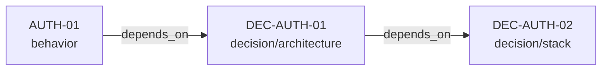
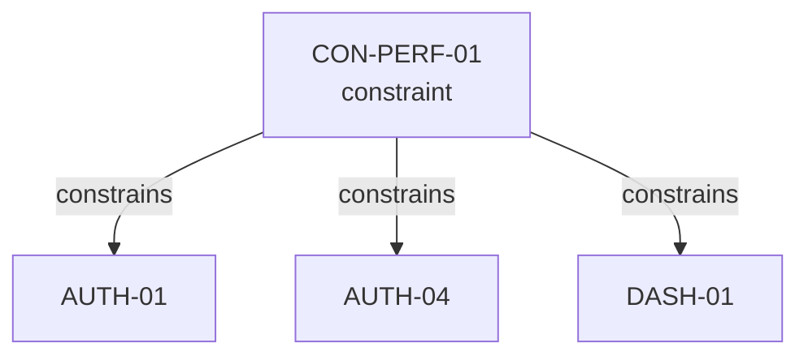
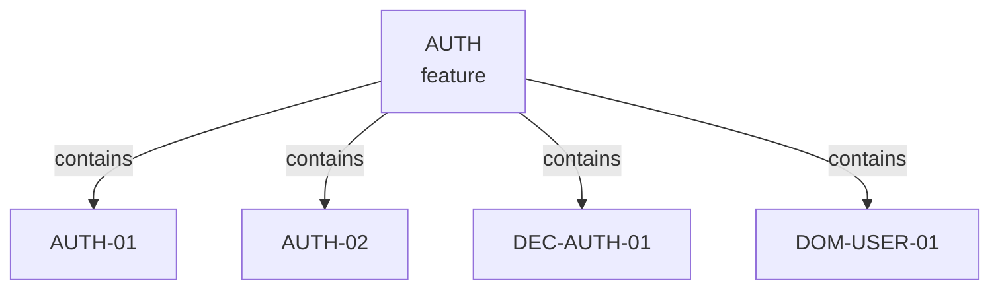

# Edge Types

Edges encode the relationships between nodes. They are the connective tissue that makes the graph more than a collection of lists.

## The Seven Edge Types

The Spec Graph defines seven forward-only edge types:

| Edge Type | Meaning | Example |
|---|---|---|
| `contains` | Grouping/namespace relationship | Feature contains its child nodes |
| `depends_on` | Must be satisfied before this node | A behavior depends on a decision being in place |
| `constrains` | Narrows implementation choices for the target | A constraint limits how a behavior can be implemented |
| `implements` | This node realizes part of the target | A behavior implements a domain concept |
| `derived_from` | Generated or imported from target (pinned hash) | A design token derived from an artifact |
| `verified_by` | Points to verification checks | A behavior verified by a test strategy node |
| `supersedes` | Replaces the target node | A new decision supersedes an old one |

## Edge Direction

Edges are **forward-only** and stored in the source node's `links` field:

```json
{
  "id": "AUTH-01",
  "type": "behavior",
  "links": {
    "implements": ["DOM-USER-01"],
    "depends_on": ["DEC-AUTH-01"]
  }
}
```

This means: "AUTH-01 implements DOM-USER-01" and "AUTH-01 depends on DEC-AUTH-01."

**Inverse edges are computed by tooling, never stored.** If `AUTH-01` depends on `DEC-AUTH-01`, tooling derives that `DEC-AUTH-01` is depended on by `AUTH-01`. This keeps the graph DRY — each relationship is declared once, on the node where it's most natural to author.

## Edge Semantics

### `contains`

Used by feature nodes to group their children. This is the primary organizational edge.

```json
// In AUTH.json (feature)
"links": {
  "contains": ["AUTH-01", "AUTH-02", "DEC-AUTH-01", "DOM-USER-01"]
}
```

### `depends_on`

Establishes ordering requirements. If A depends on B, then B must be manifested (or at least understood) before A.

**Critical rule: `depends_on` must be acyclic.** Cycles in dependency edges are a validation error.

### `constrains`

Narrows the implementation space of the target. A constraint node might constrain a behavior node, meaning the behavior must be implemented within the constraint's boundaries.

```json
// In CON-PERF-01.json (constraint)
"links": {
  "constrains": ["AUTH-01", "AUTH-04"]
}
```

### `implements`

Links a concrete node to the abstract concept it realizes. Typically used by behavior nodes pointing to domain nodes:

```json
// In AUTH-01.json (behavior)
"links": {
  "implements": ["DOM-USER-01"]
}
```

### `derived_from`

Indicates that this node was generated from or imported from another node, typically an `artifact`.

To make derivations reproducible, derived nodes should include `pins` entries that record the expected source hash at derivation time. Tooling can then detect when a derived node is stale (source hash changed) and trigger re-derivation.

### `verified_by`

Points from a node to the node(s) that verify it. Useful when verification logic is complex enough to warrant its own node (e.g., an `equivalence_contract` or `pipeline` node).

### `supersedes`

Marks a node as replacing another. The superseded node should typically have `deprecated` or `rejected` status. This supports evolution without losing history.

## Validation Rules

1. **Referential integrity**: every edge target must exist as a node in the graph
2. **No self-references**: a node cannot have an edge to itself
3. **Acyclicity for `depends_on`**: dependency chains must not form cycles
4. **Non-decorative**: edges must affect planning, implementation, or verification — purely decorative edges are discouraged

## Common Edge Patterns

### Behavior → Decision → Stack



A behavior depends on an architectural decision, which in turn depends on a technology choice.

### Constraint → Multiple Behaviors



A performance constraint applies to multiple behaviors across features.

### Feature → Children



A feature groups all related nodes regardless of type.
