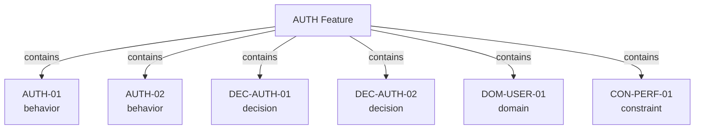

# Features & Namespaces

Features are the organizational layer of the Spec Graph. They group related nodes across all types into coherent namespaces.

## What Features Are

A feature node is a **non-normative grouping** — it organizes nodes but does not itself make any claim about the system. Features answer the question: "What logical area of the system does this spec belong to?"

```json
{
  "id": "AUTH",
  "type": "feature",
  "title": "User Authentication",
  "description": "Login, session management, and logout flows",
  "links": {
    "contains": ["AUTH-01", "AUTH-02", "AUTH-03", "DEC-AUTH-01", "DOM-USER-01", "CON-PERF-01"]
  }
}
```

## Features Group Across Types

Unlike DLOOP v1 where features contained only behaviors, Spec Graph features contain **all node types** that belong to that area of the system:



This means when you look at the AUTH feature, you see **everything** related to authentication: what the user does, how it's built, what "user" means, and what performance limits apply.

## Cross-Cutting Nodes

Some nodes naturally belong to multiple features or to no feature in particular. For example:

- A performance constraint that applies to all pages
- A domain concept used by multiple features
- A technology decision that affects the entire system

These cross-cutting nodes can be organized in a few ways:

### Shared Feature

Create a feature for cross-cutting concerns:

```json
{
  "id": "PLATFORM",
  "type": "feature",
  "title": "Platform",
  "description": "Cross-cutting infrastructure, constraints, and decisions",
  "links": {
    "contains": ["CON-PERF-01", "DEC-PLATFORM-01", "DOM-TENANT-01"]
  }
}
```

### Multiple Containment

A node can appear in multiple features' `contains` lists. This is valid — it means the node is relevant to both features:

```json
// In AUTH feature
"links": { "contains": ["DOM-USER-01", ...] }

// In BILLING feature
"links": { "contains": ["DOM-USER-01", ...] }
```

## Feature ID Conventions

Feature IDs use short, uppercase names:

| Feature | ID |
|---|---|
| User Authentication | `AUTH` |
| Task Board | `TASKBOARD` |
| Billing & Payments | `BILLING` |
| Design System | `DESIGNSYSTEM` |
| Platform/Infrastructure | `PLATFORM` |

## Features and the Directory Layout

Features map naturally to the file system. Node files are organized by type, and the feature relationship is expressed through edges:

```
specgraph/
  nodes/
    features/
      AUTH.json
      TASKBOARD.json
    behaviors/
      AUTH-01.json       # belongs to AUTH
      TASKBOARD-01.json  # belongs to TASKBOARD
    decisions/
      DEC-AUTH-01.json   # belongs to AUTH
```

The `contains` edge in the feature node is what defines membership — the file location is a convention, not a constraint.
