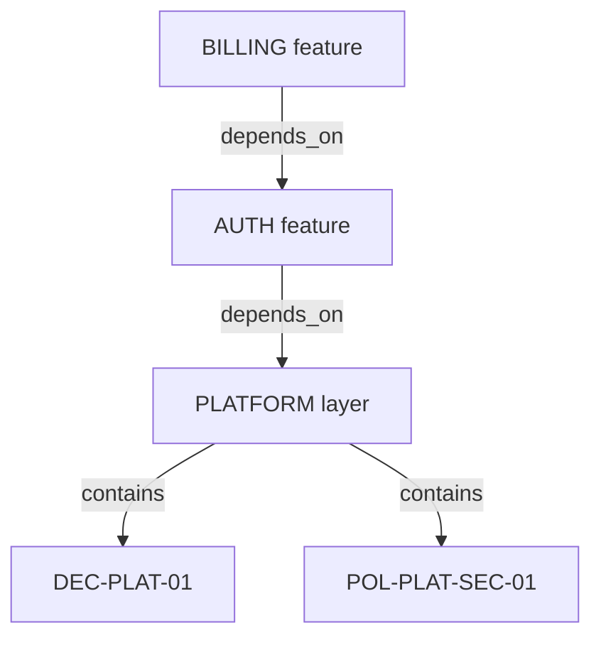

# Features & Namespaces

Spec Graph has two non-normative grouping node types:

- `feature`: vertical product slices
- `layer`: horizontal shared infrastructure

## Feature Nodes (Vertical)

A feature organizes behavior, decisions, domains, and policies for one product area.

```json
{
  "id": "AUTH",
  "type": "feature",
  "title": "User Authentication",
  "description": "Login, session management, and logout flows",
  "links": {
    "contains": ["AUTH-01", "AUTH-02", "DOM-USER-01"],
    "depends_on": ["PLATFORM"]
  }
}
```

## Layer Nodes (Horizontal)

A layer groups cross-feature platform capability.

```json
{
  "id": "PLATFORM",
  "type": "layer",
  "title": "Core Platform",
  "description": "Shared infrastructure and security/performance controls",
  "links": {
    "contains": ["DEC-PLAT-01", "POL-PLAT-SEC-01"]
  }
}
```

## Directional Rule

Layers are foundational. They cannot depend on product features.

- Allowed: `feature -> depends_on -> layer`
- Allowed: `layer -> depends_on -> layer`
- Forbidden: `layer -> depends_on -> feature`

## Cross-Feature Reuse

Use layers when multiple features share the same infrastructure context.



In this pattern, billing transitively inherits platform guidance through `BILLING -> AUTH -> PLATFORM`.

## Containment Is Membership

`contains` defines grouping membership. File location is a convention, not a semantic rule.
