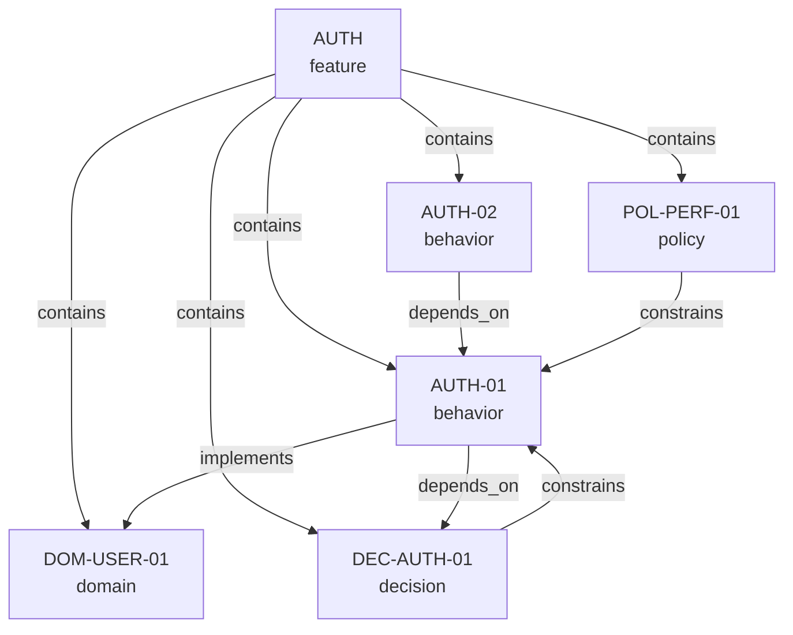

# Graph Structure

The Spec Graph is a **directed, typed graph** where nodes are specification entries and edges are relationships between them.

## Components

A Spec Graph consists of three elements:

1. **Nodes** — individual specification entries, each with a type that determines its schema
2. **Edges** — typed, directed relationships between nodes (stored inside nodes as outbound links)
3. **Features** — namespace nodes that group related nodes across types

## Storage Model

The graph is stored as a directory of JSON files:

```
specgraph/
  graph.json                    # Index: version, node references
  nodes/
    features/AUTH.json          # Feature grouping node
    behaviors/AUTH-01.json      # Behavior node
    decisions/DEC-AUTH-01.json  # Decision node
    domains/DOM-USER-01.json   # Domain node
    policies/POL-PERF-01.json     # Policy node
```

### The Index File

`graph.json` is the entry point. It lists every node in the graph with its file path:

```json
{
  "$schema": "https://oco-adam.github.io/specgraph/schemas/graph.schema.json",
  "specgraphVersion": "1.0.0",
  "nodes": [
    { "id": "AUTH", "path": "nodes/features/AUTH.json" },
    { "id": "AUTH-01", "path": "nodes/behaviors/AUTH-01.json" },
    { "id": "DEC-AUTH-01", "path": "nodes/decisions/DEC-AUTH-01.json" },
    { "id": "DOM-USER-01", "path": "nodes/domains/DOM-USER-01.json" },
    { "id": "POL-PERF-01", "path": "nodes/policies/POL-PERF-01.json" }
  ]
}
```

### Node Files

Each node is a self-contained JSON file. Edges are expressed as outbound links inside the node:

```json
{
  "id": "AUTH-01",
  "type": "behavior",
  "title": "Login Form Display",
  "expectation": "Login page renders email and password input fields with a submit button",
  "constraints": ["Password field must mask input characters"],
  "verification": "npm test -- --grep AUTH-01",
  "links": {
    "implements": ["DOM-USER-01"],
    "depends_on": ["DEC-AUTH-01"]
  }
}
```

## Node-Local Edges

Edges live inside the node that owns them. This is a deliberate design choice:

- **Atomic PRs**: changing a node and its relationships happens in one file
- **Local reasoning**: when reviewing a node, you see exactly what it depends on and constrains
- **No duplication**: outbound edges are canonical; reverse edges are computed by tooling

Only **forward edges** are stored. If `AUTH-01` depends on `DEC-AUTH-01`, the `depends_on` link is stored in `AUTH-01.json`. The inverse ("`DEC-AUTH-01` is depended on by `AUTH-01`") is computed at query time.

`Forward` here is a storage convention (declare the relationship once on the source node), not a runtime traversal limitation.

## The Graph as a Whole



At manifestation time, tooling loads all node files and constructs the full in-memory graph. The file-per-node layout is a storage concern — at runtime, it's one unified graph.

Only `depends_on` is required to be acyclic. Other edge types may form cycles when modelling legitimate mutual relationships.

## Validation

The graph is validated at two levels:

| Level | What's Checked | Tool |
|---|---|---|
| **Schema** | Each node file matches `node.schema.json`; `graph.json` matches `graph.schema.json` | JSON Schema validator (e.g., `ajv`) |
| **Graph integrity** | Referential integrity (all edge targets exist), no self-references, `depends_on` is acyclic | Graph validator tooling |

Schema validation and graph integrity validation are independent — you can validate node content without checking structural integrity, and vice versa.

### Commands

From the repo root:

```bash
# Schema validation (examples)
node validate.js

# Graph integrity validation (examples)
node graph_check.js
```
