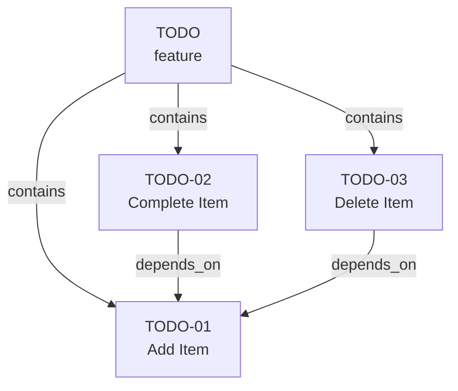

# Getting Started

This guide walks you through creating your first spec graph from scratch.

:::important AI-Agent-First Workflow
Spec Graphs are intended to be authored and consumed by AI agents. Manual editing is still valuable for learning the mechanics and debugging, but the recommended operational path is to use an agent via the [MCP server guide](/docs/guides/mcp-server).
:::

## Recommended Path (Production)

Use an AI agent with the Spec Graph MCP server:

1. Configure your MCP client to run `npx @specgraph/mcp --repo-dir .`
2. Ask the agent to call `init_specgraph`
3. Ask the agent to add/update nodes with `add_node` and `update_node`
4. Ask the agent to run `validate_specgraph` after each change

Then use the manual steps below to understand exactly what the agent is generating.

## Prerequisites

- A directory for your project's spec graph
- A text editor with JSON support
- (Optional) `ajv` or another JSON Schema validator

## Step 1: Create the Directory Structure

```bash
mkdir -p specgraph/nodes/features specgraph/nodes/behaviors
```

## Step 2: Create Your First Feature

Create `specgraph/nodes/features/TODO.json`:

```json
{
  "$schema": "https://oco-adam.github.io/specgraph/schemas/node.schema.json",
  "id": "TODO",
  "type": "feature",
  "title": "Todo List",
  "description": "A simple todo list with add, complete, and delete operations",

  "links": {
    "contains": ["TODO-01", "TODO-02", "TODO-03"]
  }
}
```

## Step 3: Add Behavior Nodes

Create `specgraph/nodes/behaviors/TODO-01.json`:

```json
{
  "$schema": "https://oco-adam.github.io/specgraph/schemas/node.schema.json",
  "id": "TODO-01",
  "type": "behavior",
  "title": "Add Todo Item",
  "expectation": "When user types text into the input field and presses Enter, a new todo item appears in the list",
  "constraints": ["Input field is cleared after adding"],
  "verification": "npm test -- --grep TODO-01"
}
```

Create `specgraph/nodes/behaviors/TODO-02.json`:

```json
{
  "$schema": "https://oco-adam.github.io/specgraph/schemas/node.schema.json",
  "id": "TODO-02",
  "type": "behavior",
  "title": "Complete Todo Item",
  "expectation": "When user clicks the checkbox next to a todo item, it is marked as complete with a strikethrough style",
  "constraints": ["Completed items remain in the list"],
  "verification": "npm test -- --grep TODO-02",

  "links": {
    "depends_on": ["TODO-01"]
  }
}
```

Create `specgraph/nodes/behaviors/TODO-03.json`:

```json
{
  "$schema": "https://oco-adam.github.io/specgraph/schemas/node.schema.json",
  "id": "TODO-03",
  "type": "behavior",
  "title": "Delete Todo Item",
  "expectation": "When user clicks the delete button on a todo item, it is removed from the list",
  "constraints": ["Deletion is immediate with no confirmation dialog"],
  "verification": "npm test -- --grep TODO-03",

  "links": {
    "depends_on": ["TODO-01"]
  }
}
```

## Step 4: Create the Graph Index

Create `specgraph/graph.json`:

```json
{
  "$schema": "https://oco-adam.github.io/specgraph/schemas/graph.schema.json",
  "specgraphVersion": "1.0.0",
  "nodes": [
    { "id": "TODO", "path": "nodes/features/TODO.json" },
    { "id": "TODO-01", "path": "nodes/behaviors/TODO-01.json" },
    { "id": "TODO-02", "path": "nodes/behaviors/TODO-02.json" },
    { "id": "TODO-03", "path": "nodes/behaviors/TODO-03.json" }
  ]
}
```

## Step 5: Validate

If you have the Spec Graph validator:

```bash
node validate.js
```

Or validate manually with `ajv`:

```bash
npx ajv validate -s graph.schema.json -d specgraph/graph.json
npx ajv validate -s node.schema.json -d specgraph/nodes/behaviors/TODO-01.json
```

## Your Spec Graph

You now have a minimal spec graph:



This is a **behavior-only** graph — the simplest valid spec graph. It specifies what the system does but leaves architecture, technology, and design to the implementing agent.

## What's Next?

- **Add decision nodes** when you want to constrain how the system is built. See [Decision Nodes](/docs/node-types/decision).
- **Add domain nodes** when business terms need explicit definition. See [Domain Nodes](/docs/node-types/domain).
- **Add policy nodes** when non-functional requirements must be measured. See [Policy Nodes](/docs/node-types/policy).
- Read [When to Add Nodes](/docs/authoring/when-to-add-nodes) for guidance on growing your graph.
- Read the [MCP Server guide](/docs/guides/mcp-server) for the recommended agent-driven workflow.
- See the [auth example](/docs/reference/examples) for a full-featured spec graph.
