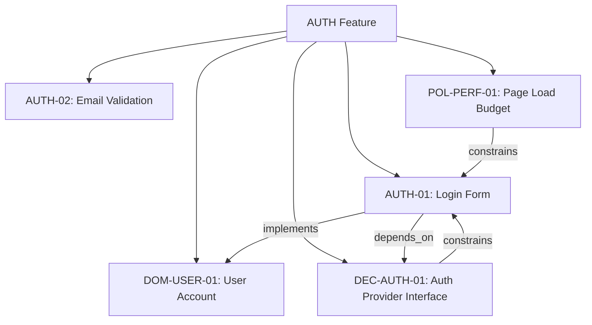

# Spec Graph

The **Spec Graph** is a formal specification framework for predictable, automated, agent-driven software development. It extends behavior-only specifications into a multi-dimensional graph that captures everything required to predictably manifest a system: behavior, architecture, design, technology choices, domain concepts, and constraints.

## Authoring Model: AI-Agent First

Spec Graph can be edited manually, and that is useful for learning and inspection.  
However, the intended operating model is:

- AI agents write and refactor spec graph nodes
- AI agents consume spec graphs to manifest systems
- humans supervise, review, and set direction

In practice, this means using agent tooling (typically via MCP) as the primary interface to the graph, while keeping the JSON structure transparent and auditable.

## The Core Idea

A Spec Graph is a directed, typed graph where:

- **Nodes** are atomic specification entries — each one captures a single decision, behavior, concept, or constraint
- **Edges** express typed relationships between nodes — dependency, constraint, implementation, containment
- **Features** are namespaces that group related nodes across types

## The Defining Property

> **The Spec Graph is the minimal structure that, when processed by a capable implementing agent, will always produce logically equivalent manifestations of the designer's intended system.**

Two agents given the same spec graph should produce systems that are indistinguishable across every dimension the designer specified — same behaviors, same architecture, same visual presentation, same domain semantics.

## What This Framework Produces

The Spec Graph framework is a **design specification**, not running code. It produces:

1. **Formal theory** — completeness, minimality, predictable manifestation
2. **Data model** — node types, edge types, and their schemas
3. **JSON Schemas** — for validating spec graph files
4. **Manifestation process** — how agents traverse and implement the graph
5. **Worked examples** — realistic spec graphs demonstrating the framework

These artifacts are sufficient for an engineering team to build a Spec Graph-based agentic development platform without further design decisions about the specification format.

## Quick Start

If you want to jump straight in:

1. Read [Motivation](/docs/introduction/motivation) to understand the problem
2. Use the [MCP Server guide](/docs/guides/mcp-server) for the recommended agent-driven workflow
3. Explore the [Graph Structure](/docs/graph/structure) to understand the data model
4. Check [Getting Started](/docs/guides/getting-started) to learn the manual file mechanics

## Background

The Spec Graph builds on lessons from [DLOOP v1](https://github.com/omnifiedLtd/selfimloop), a declarative agentic development framework that used behavior-only specifications. DLOOP v1 demonstrated the value of atomic, declarative specs driving automated development — but limiting specs to behavior alone left too many decisions unspecified. The Spec Graph is a clean-sheet redesign that addresses this completeness gap.
