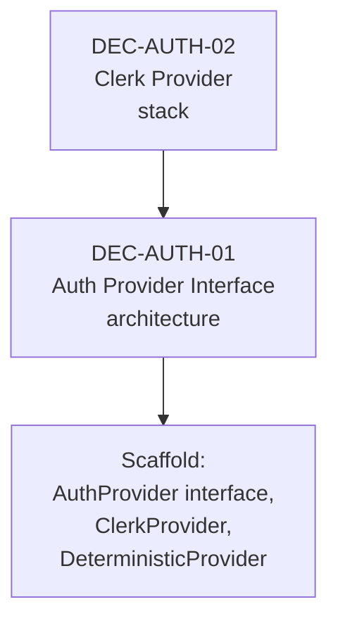
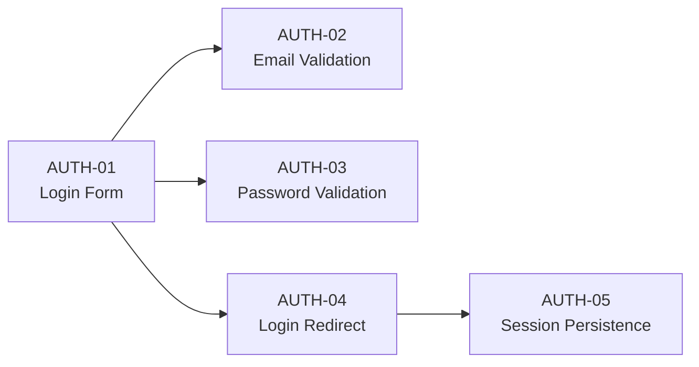

# Orient, Scaffold, Implement

The manifestation process follows three conceptual phases, each consuming a different slice of the graph.

## Phase 1: Orient

**Purpose:** Build a complete understanding of the system before writing any code.

**Reads:** All node types — domain, decision, constraint, behavior, feature

**Produces:** Mental model of the system

During orientation, the implementing agent:

1. Reads all **domain** nodes to understand the business vocabulary
2. Reads all **decision** nodes to understand architectural and technology choices
3. Reads all **constraint** nodes to understand non-functional boundaries
4. Reads all **behavior** nodes to understand what the system does
5. Traverses edges to understand how everything relates

This phase is **read-only** — no code is written. The goal is to understand the full system before making any implementation decisions.

### Why Orient First?

Without orientation, the agent makes early implementation choices that may conflict with nodes it hasn't read yet. For example:

- Building a component before knowing the design token it should use
- Choosing a data structure before reading the domain model
- Implementing a feature without knowing the performance constraint

Orientation prevents these "premature implementation" errors.

## Phase 2: Scaffold

**Purpose:** Create the architectural infrastructure that behaviors depend on.

**Reads:** Decision nodes (architecture, stack, pattern, interface), domain nodes

**Produces:** Abstractions, interfaces, shared infrastructure, configuration

During scaffolding, the agent:

1. Processes decision nodes in dependency order (topological sort on `depends_on` edges)
2. Creates abstract interfaces from `architecture` decisions
3. Configures technology choices from `stack` decisions
4. Sets up implementation patterns from `pattern` decisions
5. Creates shared types and models from domain nodes



### Dependency Order

Scaffolding respects the `depends_on` graph:

1. Technology choices first (they determine what's available)
2. Architectural patterns next (they define structure)
3. Implementation patterns last (they guide coding style)

If `DEC-AUTH-01` (AuthProvider interface) depends on `DEC-AUTH-02` (Clerk), then Clerk must be configured before the interface is created.

## Phase 3: Implement

**Purpose:** Build each behavior using the full context assembled from the graph.

**Reads:** Behavior nodes + all related nodes via edges

**Produces:** Working, verified features

For each behavior node:

1. **Resolve edges** — what decisions guide it, what constraints limit it, what domain concepts it implements
2. **Assemble context** — gather all related nodes into a unified context
3. **Implement** — build the behavior following all guidance
4. **Verify** — run the behavior's verification criteria
5. **Check constraints** — verify related constraint nodes are satisfied

### Processing Order

Behaviors are processed in dependency order:



`AUTH-01` is implemented first because `AUTH-02`, `AUTH-03`, and `AUTH-04` depend on it.

## The Full Picture

```
Phase 1: ORIENT
  Read all nodes → Build system understanding
  (No code written)

Phase 2: SCAFFOLD
  Process decision + domain nodes → Create infrastructure
  (Abstractions, interfaces, config, shared code)

Phase 3: IMPLEMENT
  For each behavior (in dependency order):
    1. Assemble context from edges
    2. Implement with full guidance
    3. Verify behavior
    4. Check constraints
```
