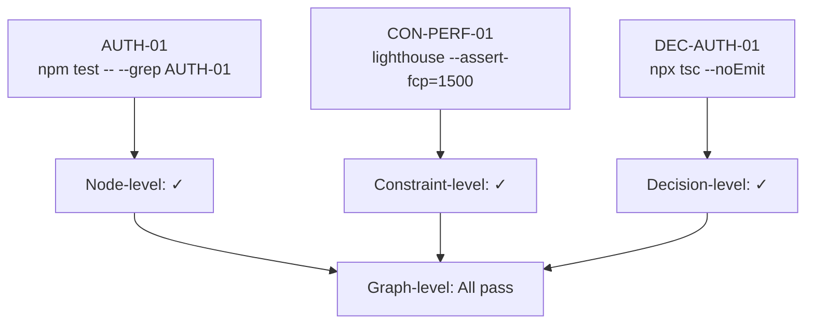

# Verification

Verification is the **spine of predictability**. Every normative node must be verifiable, and verification is what makes [equivalence](/docs/theory/equivalence) testable.

## Verification at Every Level

Verification happens at three levels during manifestation:

### Node-Level Verification

Each node has its own verification criteria. After implementing a behavior or scaffolding a decision, the agent runs the node's verification:

```json
// Behavior node
"verification": "npm test -- --grep AUTH-01"

// Decision node
"verification": [
  "npx tsc --noEmit",
  "npm test -- --grep DEC-AUTH-01"
]
```

### Constraint-Level Verification

After implementing behaviors, constraint nodes that `constrain` those behaviors are verified:

```json
// Constraint node
"verification": [
  {
    "kind": "command",
    "command": "npx lighthouse --preset=perf --assert-fcp=1500 http://localhost:3000/login"
  }
]
```

### Graph-Level Verification

After all nodes are manifested, the full graph is verified:

1. All behavior node verifications pass
2. All constraint node verifications pass
3. All decision node verifications pass
4. If an `equivalence_contract` exists, its criteria are met

## Preflight and Quality Gates

Verification answers: "Does the manifested system satisfy the spec graph?"

In practice, manifestation pipelines often include two additional operational stages that are adjacent to verification but conceptually distinct:

### Preflight Checks (Environment Readiness)

Preflight checks answer: "Is this workspace/toolchain healthy enough to start work?"

Examples:
- Dependencies installed
- Project builds
- Required services reachable
- Working directory is in a safe state

These are **agent/tooling concerns**, not properties of the manifested system, so they typically live outside the spec graph.

### Quality Gates (Project Quality Bar)

Quality gates answer: "Does the code meet the project's quality standard before we ship/review it?"

In Spec Graph terms, the **normative** quality bar should be expressed as:
- `constraint` nodes (with `severity: hard|soft` and explicit `verification` commands), and/or
- an `equivalence_contract` node that aggregates the definition of "done".

The **execution strategy** (fast vs slow ordering, fail-fast behavior, retries, timeouts, parallelism) belongs to the agent/tooling layer.

### Typical Flow

1. Run preflight checks (tooling)
2. Implement changes
3. Run fast quality gates (lint/typecheck/format)
4. Run node + constraint verification
5. Run slow gates / equivalence contract (tests/build/perf/security)

## Verification Types

The schema supports several verification formats:

### Command

The most common type — a shell command that returns exit code 0 on success:

```json
{
  "kind": "command",
  "command": "npm test -- --grep AUTH-01",
  "timeoutSeconds": 60
}
```

### HTTP

For API-level verification:

```json
{
  "kind": "http",
  "method": "POST",
  "url": "http://localhost:3000/api/auth/login",
  "expectStatus": 200
}
```

### Manual

When automated verification isn't practical:

```json
{
  "kind": "manual",
  "steps": [
    "Open Chrome DevTools Performance tab",
    "Record while scrolling through all columns",
    "Verify no frames exceed 16ms"
  ],
  "expected": "All frames render within 16ms budget"
}
```

### Observation

A simpler manual check — visual inspection or qualitative assessment:

```json
{
  "kind": "observation",
  "description": "Visual inspection: task cards match spec in all four columns"
}
```

### Policy

Reference to an external policy or rule:

```json
{
  "kind": "policy",
  "ruleId": "WCAG-2.1-AA",
  "description": "All interactive elements are keyboard accessible"
}
```

## Verification and Determinism

Verification is the mechanism by which equivalence is established. If every node's verification passes for both manifestation M₁ and M₂, the systems are equivalent under the graph's equivalence relation.

This means good verification criteria are crucial:

- **Specific**: test exactly what the node specifies
- **Deterministic**: produce the same result for the same system state
- **Independent**: don't depend on execution order or external services (where possible)
- **Fast**: encourage frequent re-verification

## The Verification Chain

Verification flows through the graph:



When all three levels pass, the manifestation is verified.
