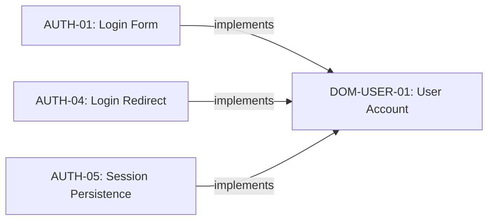

# Domain Nodes

Domain nodes capture **business concepts, terms, and rules** — the ubiquitous language of the system. They establish shared vocabulary so that when a behavioral spec says "user," both the spec author and the implementing agent agree on exactly what "user" means.

## Schema

```json
{
  "id": "DOM-USER-01",
  "type": "domain",
  "title": "User Account",
  "statement": "A registered entity that can authenticate, own resources, and have role-based permissions within a project.",
  "constraints": [
    "A user must have exactly one role per project (owner, admin, or member)",
    "Email uniqueness is enforced at the database level",
    "Every user must have a verified email before accessing any resource"
  ],
  "verification": [
    "Database schema enforces email uniqueness",
    "npm test -- --grep DOM-USER-01"
  ],
  "status": "approved",
  "metadata": {
    "rationale": "Establishes shared vocabulary for 'user' across the system."
  }
}
```

## Fields

| Field | Required | Description |
|---|---|---|
| `id` | Yes | Unique identifier (e.g., `DOM-USER-01`) |
| `type` | Yes | Must be `"domain"` |
| `title` | Yes | The concept name (3–140 chars) |
| `statement` | Yes | What this concept IS — its definition |
| `constraints` | No | Business rules governing this concept |
| `verification` | Yes | How to verify the domain model is correct (min 1) |
| `status` | Yes | Lifecycle status |
| `links` | No | Outbound edges |
| `metadata` | No | Non-normative context |

## The Statement Field

For domain nodes, the `statement` is a **definition**: what the concept IS in the business domain.

**Good:**
```
"statement": "A registered entity that can authenticate, own resources, and have role-based permissions within a project."
```

**Bad:**
```
"statement": "Users can log in and manage their projects."
```
The bad example describes behaviors, not the concept itself. Behaviors belong in behavior nodes.

## Constraints as Business Rules

The `constraints` array captures the business rules governing this concept:

```json
"constraints": [
  "A user must have exactly one role per project",
  "Email uniqueness is enforced at the database level",
  "Tasks are created in 'backlog' status by default",
  "Status transitions follow: backlog → in-progress → review → done"
]
```

Each constraint is a normative rule that implementations must respect.

## When to Create Domain Nodes

Apply the minimality test:

> "If I removed this definition, could the implementing agent misunderstand what this business term means?"

Common triggers:

| Scenario | Example |
|---|---|
| A business term is ambiguous | "User" could mean account, profile, or person |
| A concept has non-obvious rules | Tasks have a specific status transition order |
| Multiple behaviors reference the same concept | Several behaviors deal with "projects" |
| Domain rules constrain implementation | "Email must be unique" affects database design |

## Relationship to Behaviors

Domain nodes are often **implemented by** behavior nodes:



This means these behaviors collectively realize the "User Account" concept.

## ID Conventions

Domain IDs follow the pattern `DOM-CONCEPT-##`:

- `DOM-USER-01` — User Account
- `DOM-TASK-01` — Task (in a task management system)
- `DOM-PROJECT-01` — Project
- `DOM-TENANT-01` — Tenant (in a multi-tenant system)
