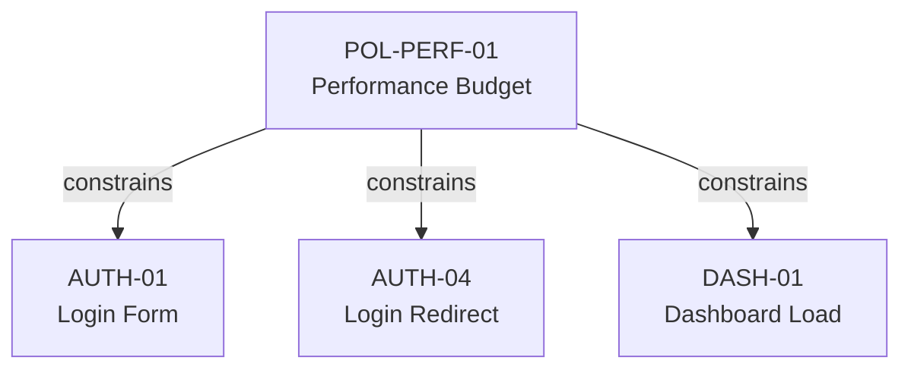

# Policy Nodes

Policy nodes capture **cross-cutting non-functional requirements** — performance budgets, security policies, accessibility standards, cost limits, reliability targets.

## Schema

```json
{
  "id": "POL-PERF-01",
  "type": "policy",
  "severity": "hard",
  "title": "Page Load Performance Budget",
  "statement": "All pages must reach First Contentful Paint within 1.5 seconds on a 4G connection.",
  "constraints": [
    "FCP must be measured under simulated 4G conditions",
    "Budget applies to all routes including the login page"
  ],
  "verification": [
    {
      "kind": "command",
      "command": "npx lighthouse --preset=perf --assert-fcp=1500 http://localhost:3000"
    }
  ],
  "links": {
    "constrains": ["AUTH-01", "AUTH-04"]
  },
  "metadata": {
    "rationale": "Core Web Vitals compliance for SEO and user experience."
  }
}
```

## Fields

| Field | Required | Description |
|---|---|---|
| `id` | Yes | Unique identifier (e.g., `POL-PERF-01`) |
| `type` | Yes | Must be `"policy"` |
| `severity` | No | `"hard"` (blocks manifestation) or `"soft"` (quality target) |
| `title` | Yes | Short name (3–140 chars) |
| `statement` | Yes | What must be true, with measurable criteria |
| `constraints` | No | Normative sub-conditions that further narrow this node's statement |
| `verification` | Yes | How to measure compliance (min 1) |
| `links` | No | Outbound edges (typically `constrains`) |
| `metadata` | No | Non-normative context |

## Severity

The `severity` field distinguishes between requirements that block manifestation and those that are quality targets:

### `hard`

A hard policy **must** be satisfied. If verification fails, manifestation is blocked.

```json
{
  "severity": "hard",
  "statement": "All pages must reach FCP within 1.5s on 4G."
}
```

### `soft`

A soft policy is a **quality target**. Failing it produces a warning, not a blocker.

```json
{
  "severity": "soft",
  "statement": "API response times should be under 200ms at p50."
}
```

If `severity` is omitted, tooling should treat the policy as `hard` by default.

## Policy Categories

Policy nodes cover a wide range of non-functional requirements:

| Category | Examples |
|---|---|
| **Performance** | Latency budgets, throughput minimums, bundle size limits |
| **Security** | Authentication requirements, data encryption, input validation |
| **Accessibility** | WCAG compliance level, keyboard navigation, screen reader support |
| **Reliability** | Uptime targets, error rate limits, recovery time |
| **Cost** | Cloud spend ceilings, API call budgets |

## The `constrains` Edge

Policy nodes typically use the `constrains` edge to declare which nodes they apply to:



A single policy can apply to many behaviors across multiple features.

## When to Create Policy Nodes

Apply the minimality test:

> "If I removed this, could the implementing agent produce a system that violates a non-functional requirement I care about?"

Common triggers:

| Scenario | Policy Type |
|---|---|
| Pages must load within a time budget | Performance |
| All user data must be encrypted at rest | Security |
| The app must meet WCAG 2.1 AA | Accessibility |
| Monthly cloud costs must stay under $500 | Cost |
| Board must render 200 cards at 60fps | Performance |

## ID Conventions

Policy IDs follow the pattern `POL-CATEGORY-##` or `POL-FEATURE-CATEGORY-##`:

- `POL-PERF-01` — global performance policy
- `POL-SEC-01` — global security policy
- `POL-TB-PERF-01` — taskboard-specific performance policy
