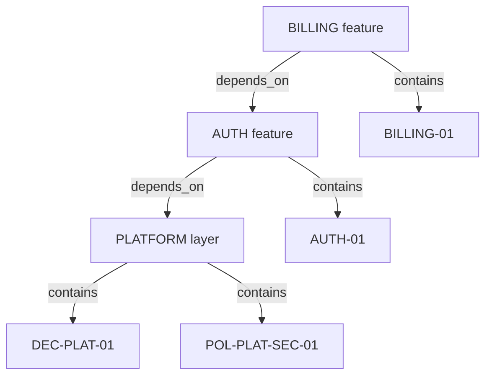

# Examples

Four worked examples are provided, each emphasizing a different part of the model.

## Minimal: Todo List

**Purpose:** Smallest valid graph (behavior-first adoption).

**Node types used:** `feature`, `behavior`

**Source:** [`examples/minimal/`](pathname:///specgraph/examples/minimal/graph.json)

## Auth: User Authentication

**Purpose:** Canonical core example with behavior, decisions, domain, and policy nodes.

**Node types used:** `feature`, `behavior`, `decision`, `domain`, `policy`

**Source:** [`examples/auth/`](pathname:///specgraph/examples/auth/graph.json)

## Layered: Shared Platform Layer

**Purpose:** Demonstrates feature/layer coexistence, transitive dependency (`B -> A -> L`), and layer-originated guidance.

**Node types used:** `feature`, `layer`, `behavior`, `decision`, `policy`

**Source:** [`examples/layered/`](pathname:///specgraph/examples/layered/graph.json)

## Taskboard: Kanban Task Board

**Purpose:** Richer example with extension types.

**Node types used:** `feature`, `behavior`, `decision`, `domain`, `policy`, `design_token`, `artifact`

**Source:** [`examples/taskboard/`](pathname:///specgraph/examples/taskboard/graph.json)
