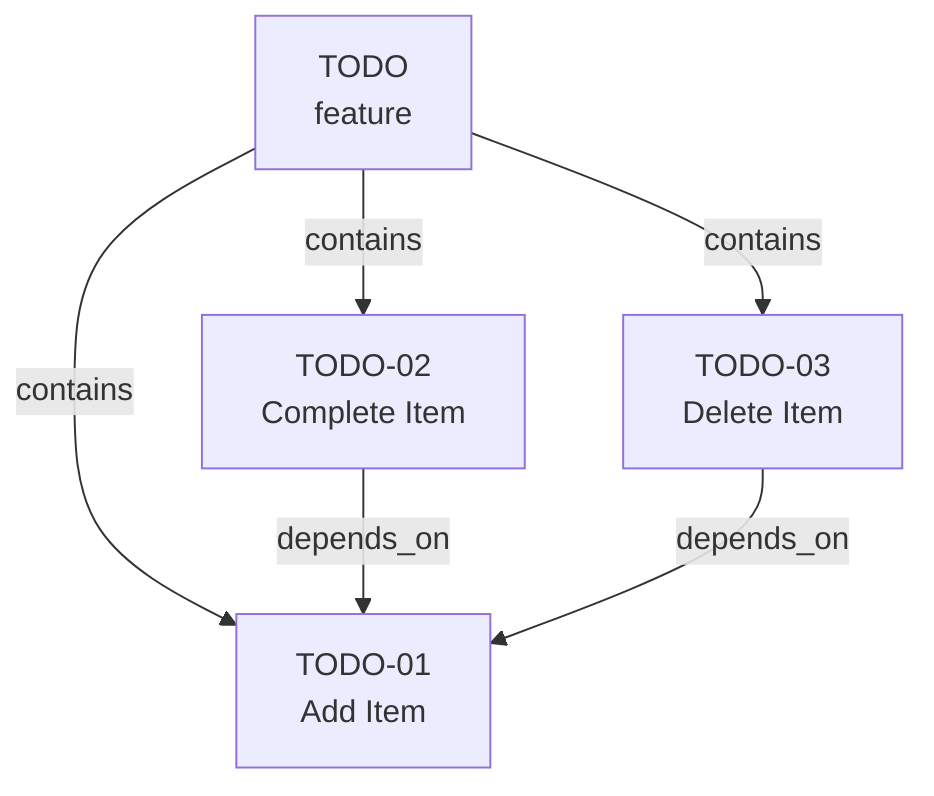
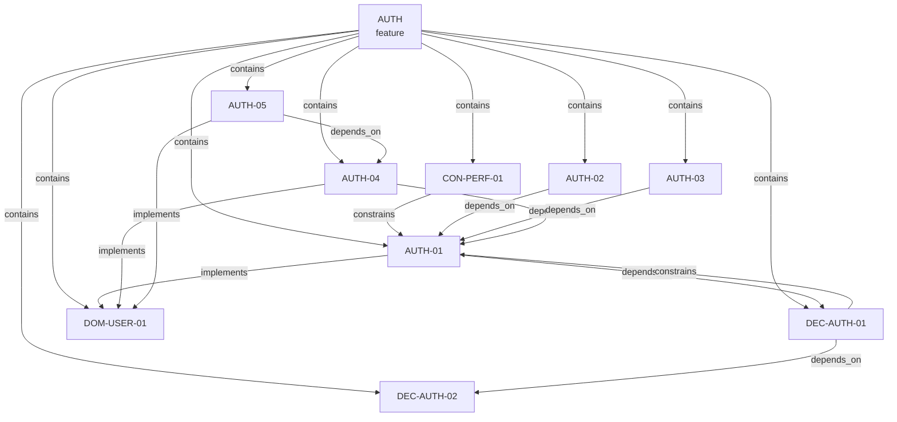

# Examples

Three worked examples are provided, each demonstrating different aspects of the Spec Graph.

## Minimal: Todo List

**Purpose:** The simplest valid spec graph — behavior nodes only.

**Node types used:** `feature`, `behavior`

**Source:** [`examples/minimal/`](pathname:///specgraph/examples/minimal/graph.json)

```
minimal/
  graph.json
  nodes/
    features/TODO.json
    behaviors/TODO-01.json    # Add todo item
    behaviors/TODO-02.json    # Complete todo item
    behaviors/TODO-03.json    # Delete todo item
```

This example demonstrates [progressive adoption](/docs/guides/progressive-adoption) at Level 1 — a behavior-only graph. It's the starting point for any project.



## Auth: User Authentication

**Purpose:** The primary example used throughout the documentation. Demonstrates all five core node types.

**Node types used:** `feature`, `behavior`, `decision`, `domain`, `constraint`

**Source:** [`examples/auth/`](pathname:///specgraph/examples/auth/graph.json)

```
auth/
  graph.json
  nodes/
    features/AUTH.json
    behaviors/AUTH-01.json through AUTH-05.json
    decisions/DEC-AUTH-01.json    # Auth provider abstraction (architecture)
    decisions/DEC-AUTH-02.json    # Clerk provider (stack)
    domains/DOM-USER-01.json     # User Account concept
    constraints/CON-PERF-01.json # Page load budget
```



### What This Demonstrates

- **Decision nodes** with different categories (architecture vs. stack)
- **Domain nodes** defining shared vocabulary
- **Constraint nodes** with severity and structured verification
- **Edge patterns**: `implements`, `depends_on`, `constrains`
- **Dependency chain**: behavior → decision → decision

## Taskboard: Kanban Task Board

**Purpose:** A richer example showing extension types alongside core types.

**Node types used:** `feature`, `behavior`, `decision`, `domain`, `constraint`, `design_token`

**Source:** [`examples/taskboard/`](pathname:///specgraph/examples/taskboard/graph.json)

```
taskboard/
  graph.json
  nodes/
    features/TASKBOARD.json
    behaviors/TASKBOARD-01.json through TASKBOARD-03.json
    decisions/DEC-TB-01.json     # Optimistic updates (pattern)
    decisions/DEC-TB-02.json     # Real-time sync (pattern)
    decisions/DEC-TB-03.json     # DnD Kit (stack)
    domains/DOM-TASK-01.json     # Task concept with status transitions
    constraints/CON-TB-PERF-01.json  # 60fps render performance
    design_tokens/DT-TASKCARD-01.json # Task card visual spec
```

### What This Demonstrates

- **Extension type** (`design_token`) used alongside core types
- **Multiple decision categories**: pattern and stack
- **Rich domain model** with status transitions and business rules
- **Performance constraint** with manual verification steps
- **Visual specification** through design tokens
