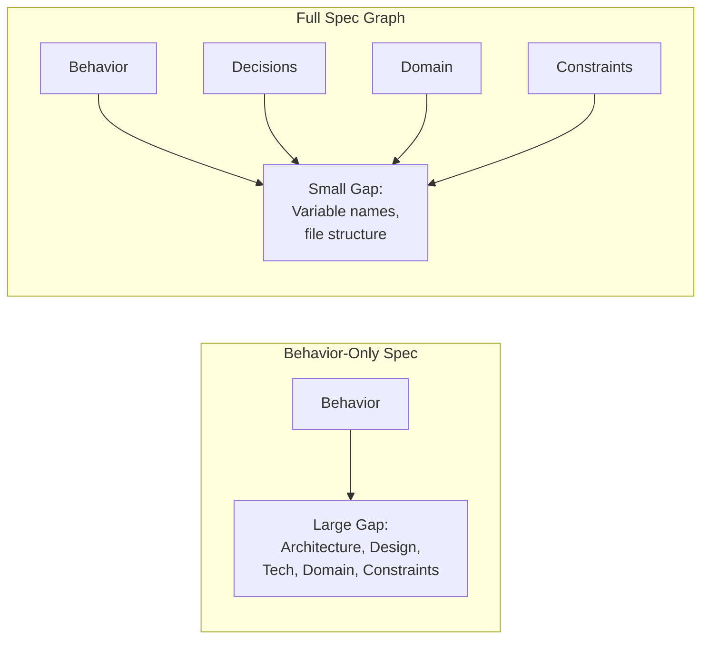

# The Completeness Gap

In practice, no spec graph is perfectly complete. There will always be some ambient knowledge the agent brings — language semantics, framework conventions, common sense. The **completeness gap** measures what's left unspecified.

## Definition

```
Completeness Gap = {decisions the agent must make} − {decisions the spec determines}
```

A behavior-only spec has a **large** completeness gap: the agent must decide architecture, technology, design, domain model, and constraints entirely on its own. Each additional node type in the graph **shrinks** the gap.

## Visualizing the Gap



## What Lives in the Gap

The completeness gap contains every decision the agent makes that isn't determined by the spec. These fall into categories:

### Benign Decisions (Acceptable Gap)

Decisions where any reasonable choice produces an equivalent system:

- Variable and function naming conventions
- File and directory organization (within a framework's conventions)
- Import ordering
- Comment placement
- Test organization details

These are part of the "acceptable residual" — the gap that remains even in a complete-enough graph.

### Dangerous Decisions (Unacceptable Gap)

Decisions where different choices produce materially different systems:

- Whether to use an abstraction layer or call a service directly
- Which state management pattern to use
- How to handle error recovery
- What the color palette is
- Whether a business rule is enforced in the UI, API, or database

If these decisions are in the gap, the spec is not complete enough.

## Shrinking the Gap

The practical question is always:

> **Is the remaining gap small enough that the agent's choices won't violate the designer's intent?**

Each node type addresses a specific category of decisions:

| Node Type | Gap It Closes |
|---|---|
| `behavior` | What the system does |
| `decision` | How it's structured and what it's built with |
| `domain` | What business concepts mean |
| `constraint` | What non-functional boundaries must hold |
| `feature` | How specs are organized and grouped |

Extension types (`design_token`, `api_contract`, etc.) close additional specialized gaps as needed.

## The Gap Is Relative

The completeness gap depends on the **implementing agent's capabilities**. A more capable agent (with better defaults, stronger conventions, deeper framework knowledge) has a smaller effective gap — it fills in reasonable choices where a less capable agent might diverge.

The Spec Graph targets a **competent but uninformed** agent: one that knows how to code well but has no special knowledge of this system's design intent. Everything the designer cares about must be in the graph.
